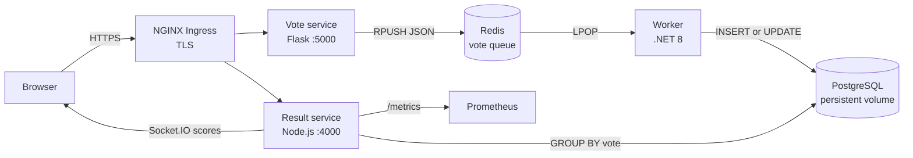
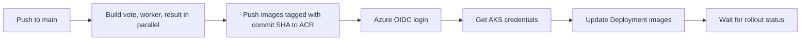

# Cloud-Native Voting Platform


> **A production-minded cloud engineering project:** asynchronous voting, durable persistence, live results, Kubernetes operations, Prometheus observability, and Azure delivery in one small but complete platform.

An event-driven voting application that demonstrates how a small product can be decomposed, containerized, observed, and deployed to Kubernetes on Azure.

A browser submits a vote to a Flask service, the request is buffered in Redis, a .NET worker persists the vote to PostgreSQL, and a Node.js service continuously publishes aggregated results to browsers over Socket.IO. The same services run locally with Docker Compose and in AKS through Kubernetes manifests and GitHub Actions.

## Portfolio Snapshot

| Area | Implemented in this repository |
| --- | --- |
| **Application architecture** | Three independently containerized services with a Redis producer-consumer boundary and PostgreSQL persistence |
| **Cloud platform** | Azure Kubernetes Service (AKS) for orchestration and Azure Container Registry (ACR) for private image storage |
| **Deployment automation** | GitHub Actions builds the service images in parallel, pushes commit-SHA tags to ACR, authenticates to Azure with OIDC, and waits for AKS rollouts |
| **Networking** | Kubernetes Services for internal DNS plus NGINX Ingress for host-based external routing |
| **Transport security** | cert-manager ClusterIssuer configured for Let's Encrypt ACME HTTP-01 certificates |
| **Observability** | Prometheus-compatible metrics, a Kubernetes ServiceMonitor, and a worker availability alert |
| **State management** | PostgreSQL StatefulSet with a persistent volume claim; stateless APIs run as Deployments |
| **Engineering judgment** | Documented consistency model, queue-loss failure mode, security limitations, and prioritized production roadmap |

This is the intended hiring-manager summary: the project demonstrates both implementation ability and the judgment to explain where a demonstration system must be hardened before it becomes a production system.

> **Project status:** This is an interview-ready platform demonstration. The core workflow is implemented and deployable, while the production hardening section explicitly documents remaining reliability, security, and operational work. That distinction is deliberate: strong engineering documentation makes trade-offs visible instead of hiding them.

## What This Demonstrates

- Service decomposition across Python, .NET, and Node.js
- Producer-consumer messaging with Redis
- Asynchronous persistence into PostgreSQL
- Voter-level update behavior: a voter can change their selection
- Containerized local development with Docker Compose
- Kubernetes Deployments, Services, a StatefulSet, ConfigMap, Secret, Ingress, and PVC
- TLS issuance through cert-manager and Let's Encrypt
- Prometheus metrics, a ServiceMonitor, and a worker availability alert
- SHA-tagged container releases from GitHub Actions to Azure Container Registry and AKS
- Honest analysis of delivery semantics, stateful workloads, and production gaps

## Architecture



### Request and data flow

1. The vote service renders the voting page and assigns a `voter_id` cookie when the browser does not already have one.
2. A submitted choice is serialized as JSON and appended to the Redis `votes` list.
3. The worker polls Redis, removes the next message, and writes it to PostgreSQL.
4. PostgreSQL stores one row per voter. A later vote from the same voter updates the existing row.
5. The result service aggregates rows by option and broadcasts current counts to connected browsers every second.
6. Prometheus scrapes the result service for runtime and application metrics.

The browser-facing request is decoupled from database latency. The trade-off is eventual consistency: a vote may not appear in results until the worker has processed it.

## Services

| Service | Technology | Responsibility | Port |
| --- | --- | --- | --- |
| `vote` | Python 3.11, Flask | Renders the ballot and publishes vote messages | `5000` |
| `worker` | .NET 8, Npgsql, StackExchange.Redis | Consumes Redis messages and persists votes | None |
| `result` | Node.js 20, Express, Socket.IO, `pg` | Aggregates votes, serves results UI, pushes live scores | `4000` |
| `redis` | Redis 7 | Temporary vote queue | `6379` |
| `postgres` | PostgreSQL 15 | Durable vote storage | `5432` |

## Repository Layout

```text
.
├── .github/workflows/deploy.yaml       # Build, push, and AKS rollout workflow
├── docker-compose.yml                  # Local multi-container environment
├── vote/                               # Flask producer and voting UI
├── worker/                             # .NET background consumer
├── result/                             # Node.js results API and Socket.IO UI
└── k8s-specifications/                 # Kubernetes resources
    ├── *-deployment.yaml               # vote, worker, result, and Redis
    ├── *-service.yaml                  # ClusterIP networking
    ├── postgres-statefulset.yaml        # PostgreSQL and 1 GiB PVC template
    ├── configmap.yaml                  # Voting options
    ├── postgres-secret.yaml             # PostgreSQL credentials
    ├── ingress.yaml                    # Host-based routing and TLS
    ├── cluster-issuer-prod.yaml         # Let's Encrypt issuer
    ├── result-servicemonitor.yaml       # Prometheus scrape configuration
    └── worker-alert.yaml                # Worker availability alert
```

## Implementation Evidence

The platform claims above are backed by concrete repository artifacts:

| Capability | Where to inspect it |
| --- | --- |
| Local multi-service environment | `docker-compose.yml` |
| Flask vote producer | `vote/app.py` and `vote/Dockerfile` |
| Redis-to-PostgreSQL background processing | `worker/Program.cs` and `worker/dockerfile` |
| Live result aggregation and metrics | `result/server.js` and `result/Dockerfile` |
| Kubernetes application workloads | `k8s-specifications/*-deployment.yaml` |
| Stable internal service discovery | `k8s-specifications/*-service.yaml` |
| Durable PostgreSQL storage | `k8s-specifications/postgres-statefulset.yaml` |
| External routing and TLS | `k8s-specifications/ingress.yaml` and `cluster-issuer-prod.yaml` |
| Prometheus scraping and alerting | `result-servicemonitor.yaml` and `worker-alert.yaml` |
| Azure build and deployment automation | `.github/workflows/deploy.yaml` |

## Azure Delivery Path

The cloud deployment is intentionally traceable from source commit to running workload:

1. A push to `main` starts GitHub Actions.
2. A matrix build creates separate `vote`, `worker`, and `result` images in parallel.
3. Azure OIDC login obtains short-lived cloud credentials without storing a long-lived Azure password in the workflow.
4. Each image is pushed to Azure Container Registry using the Git commit SHA as its immutable release identifier.
5. The deployment job retrieves AKS credentials with `az aks get-credentials`.
6. `kubectl set image` updates the three Kubernetes Deployments to the new ACR image tags.
7. `kubectl rollout status` makes the workflow wait for the new workloads to become available.
8. NGINX Ingress routes the public hosts to the services, while cert-manager requests and renews Let's Encrypt certificates.

This gives the project a clear operational story: build once, publish an immutable artifact, deploy that artifact to AKS, and verify rollout completion. The remaining production additions are documented below rather than implied.

## Run Locally

### Prerequisites

- Docker Desktop with Docker Compose
- A browser
- Optional: `kubectl`, an AKS cluster, and Azure CLI for cloud deployment

### Start the complete stack

```bash
git clone <repository-url>
cd k8s-voting-app-azure
docker compose up --build
```

Open:

- Voting UI: <http://localhost:5000>
- Results UI: <http://localhost:4000>
- Metrics: <http://localhost:4000/metrics>

The Compose environment provides Redis and PostgreSQL on their default container ports. Database data is not declared with a named Compose volume, so treat this setup as disposable development infrastructure.

Stop the stack:

```bash
docker compose down
```

To also remove anonymous volumes:

```bash
docker compose down -v
```

### Verify the workflow

1. Submit a vote at `http://localhost:5000`.
2. Open `http://localhost:4000` in another tab.
3. Change the vote in the first tab and observe the updated aggregate after the worker processes the message.
4. Inspect worker logs:

```bash
docker compose logs -f worker
```

## Kubernetes and AKS

The manifests use Kubernetes Service DNS names for internal communication:

```text
vote      -> vote:5000
redis     -> redis:6379
postgres  -> postgres:5432
result    -> result:4000
```

The checked-in resources create one replica for each application Deployment and Redis, plus a single PostgreSQL StatefulSet replica with a 1 GiB `ReadWriteOnce` PVC. The result Deployment has CPU and memory requests/limits; the other workloads do not yet have resource policies.

### Prerequisites for the full manifest set

- An accessible Kubernetes cluster, such as AKS
- NGINX Ingress Controller
- cert-manager and its CRDs
- Prometheus Operator for `ServiceMonitor` and `PrometheusRule`
- DNS records for the configured hosts
- An image registry accessible by the cluster

The monitoring resources assume a Prometheus installation in the `monitoring` namespace with the label selector used by the manifests. The ClusterIssuer assumes the ingress controller can solve the HTTP-01 challenge.

### Apply and verify

```bash
kubectl apply -f k8s-specifications/
kubectl get pods
kubectl get deployments
kubectl get services
kubectl get pvc
kubectl get ingress
```

```bash
kubectl rollout status deployment/vote
kubectl rollout status deployment/worker
kubectl rollout status deployment/result
```

The Ingress currently routes:

| Host | Backend |
| --- | --- |
| `voting-platform.duckdns.org` | `vote:5000` |
| `result-page.duckdns.org` | `result:4000` |

These are repository configuration values, not guaranteed live endpoints. Replace them with domains controlled by the deployment owner and point DNS to the ingress public address.

## Configuration and Secrets

Voting options are supplied through `VOTING_OPTIONS` as a comma-separated list:

```text
Python,Java,JavaScript,C++,Go,Rust,C#,C
```

Local Compose uses:

```text
REDIS_HOST=redis
DB_HOST=postgres
DB_USER=postgres
DB_PASSWORD=postgres
DB_NAME=postgres
```

Kubernetes stores voting options in `voting-config` and PostgreSQL credentials in `postgres-secret`. The checked-in Secret values are base64-encoded defaults, not encryption. Do not use them for a real environment; use Azure Key Vault with a CSI driver, sealed secrets, or an equivalent external secret system.

## API and Runtime Endpoints

| Service | Method and path | Purpose |
| --- | --- | --- |
| Vote | `GET /` | Render the ballot |
| Vote | `POST /` | Queue a selected option |
| Result | `GET /options` | Return configured options and support health probes |
| Result | `GET /metrics` | Expose Prometheus metrics |
| Result | Socket.IO connection | Send `scores` updates to browsers |

Redis messages have this shape:

```json
{"voter_id":"<cookie-derived-id>","vote":"Python"}
```

## Data Model

The worker creates the table on startup if it does not already exist:

```sql
CREATE TABLE IF NOT EXISTS votes (
    id VARCHAR(255) NOT NULL UNIQUE,
    vote VARCHAR(255) NOT NULL
);
```

`id` is the browser's voter identifier and acts as the uniqueness constraint. The worker first attempts an insert; if the insert raises a PostgreSQL exception, it falls back to updating that voter. The result service runs `GROUP BY vote` and initializes configured options to zero so options with no votes are still displayed.

## Observability

The result service uses `prom-client` to expose default Node.js metrics plus:

```text
voting_app_current_votes{option="<option>"}
```

The Kubernetes monitoring resources provide:

- A `ServiceMonitor` scraping `/metrics` every 15 seconds
- A `WorkerDown` `PrometheusRule` when the worker has no available replica for one minute
- A result-service endpoint that can be queried directly during local development

Useful commands:

```bash
kubectl logs deployment/worker
kubectl logs deployment/result
kubectl describe pod <pod-name>
kubectl get events --sort-by=.lastTimestamp
```

## CI/CD to ACR and AKS

The workflow in `.github/workflows/deploy.yaml` runs on pushes to `main`:



The workflow expects these GitHub repository variables:

```text
AZURE_CLIENT_ID
AZURE_TENANT_ID
AZURE_SUBSCRIPTION_ID
ACR_NAME
AKS_RESOURCE_GROUP
AKS_CLUSTER_NAME
```

The workflow deploys images tagged with `${{ github.sha }}` using `kubectl set image`. The deployed image is therefore traceable to the source commit that triggered the workflow.

The current pipeline is a deployment pipeline, not a full verification pipeline: it does not yet run automated tests, image scanning, manifest validation, or a staged approval before production rollout.

## Engineering Decisions and Trade-offs

### Why Redis between HTTP and PostgreSQL?

It keeps vote submission fast and isolates the request path from transient database latency. It also creates a producer-consumer boundary that can absorb short bursts of traffic.

### Why a separate .NET worker?

Persistence is an independently deployable concern with its own runtime and scaling characteristics. The worker can restart without taking the public voting UI offline.

### Why a PostgreSQL StatefulSet?

PostgreSQL owns durable application state, so it receives a stable identity and persistent volume. Stateless application services use Deployments and Services instead.

### What consistency model does the application provide?

Vote submission is acknowledged after the message is appended to Redis, while the result page reads PostgreSQL. The user experience is eventually consistent, usually within the worker polling interval and result refresh interval.

### What happens if the worker crashes?

The current worker uses `LPOP`, which removes a message before PostgreSQL persistence completes. A crash between those operations can lose that vote. This is a known limitation, not an exactly-once guarantee.

### Is the voter identity secure?

No. The `voter_id` is a random browser cookie and is not an authenticated identity. It demonstrates update semantics for a browser session, not election-grade voter verification or fraud prevention.

## Production Hardening Roadmap

1. **Prevent message loss:** use Redis Streams with consumer groups, or a reliable queue pattern with acknowledgement, retries, a dead-letter path, and visibility timeouts.
2. **Make persistence idempotent:** use `INSERT ... ON CONFLICT (id) DO UPDATE` and validate allowed vote options before writing.
3. **Protect secrets:** remove default credentials from manifests and use Azure Key Vault with a CSI driver or an equivalent external secret system.
4. **Harden the application:** disable Flask debug mode, validate request input, set secure cookie attributes, add authentication/rate limiting as required, and run containers as non-root users.
5. **Improve availability:** use managed PostgreSQL, Redis HA/persistence, backups with restore drills, multiple replicas, PodDisruptionBudgets, and autoscaling where load justifies it.
6. **Strengthen delivery:** add unit/integration tests, container vulnerability scanning, SBOM generation, Kubernetes schema validation, and progressive rollout or approval gates.
7. **Close observability gaps:** add queue depth, processing latency, failed-message, database-connection, and end-to-end vote-freshness metrics.
8. **Manage schema explicitly:** introduce migrations instead of creating the table from application startup code.

## Interview Guide

### A concise project explanation

> I built a containerized voting platform with a Flask producer, a Redis queue, a .NET persistence worker, PostgreSQL as the durable store, and a Node.js Socket.IO result service. It runs with Docker Compose locally and is modeled for AKS with Kubernetes manifests, ingress/TLS, Prometheus monitoring, and SHA-based GitHub Actions deployments. The key design choice is asynchronous persistence, which keeps the request path responsive but introduces eventual consistency and requires stronger acknowledgement semantics for production.

### Questions worth being ready to answer

- Where is the system eventually consistent, and how would you communicate that to users?
- How would you prevent a worker crash from losing a Redis message?
- Why is a Kubernetes StatefulSet appropriate for PostgreSQL but not for API services?
- How would you scale the worker without creating duplicate votes?
- How would you authenticate voters if this were a real election?
- What would you monitor to detect a growing backlog before users notice stale results?
- How would you perform a rollback when a SHA-tagged release fails its rollout?
- What is the difference between a base64 Kubernetes Secret and encrypted secret management?
- Which components are single points of failure in the current deployment?
- How would you test the complete flow from HTTP submission to Socket.IO update?

### Strong answers should mention

- At-least-once processing plus idempotent writes is usually preferable to claiming exactly-once delivery.
- The current Redis `LPOP` sequence is not durable acknowledgement semantics.
- A cookie-based identifier is a demo mechanism, not identity, authorization, or anti-abuse protection.
- A single PostgreSQL replica and a single Redis replica are availability limitations.
- Metrics should measure infrastructure health and business freshness, not only process uptime.

## License

No license is currently specified in the repository.